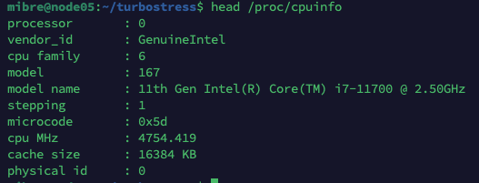
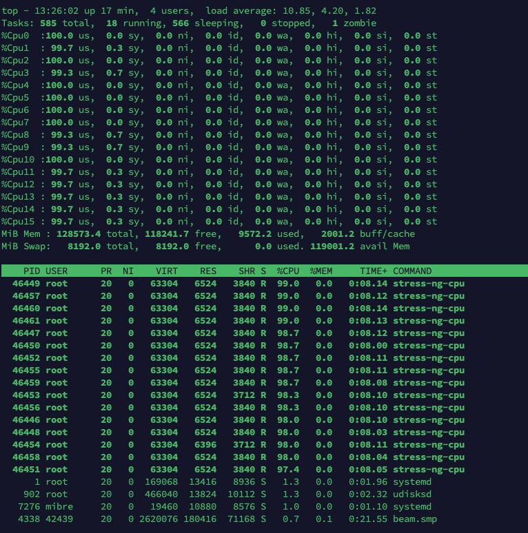
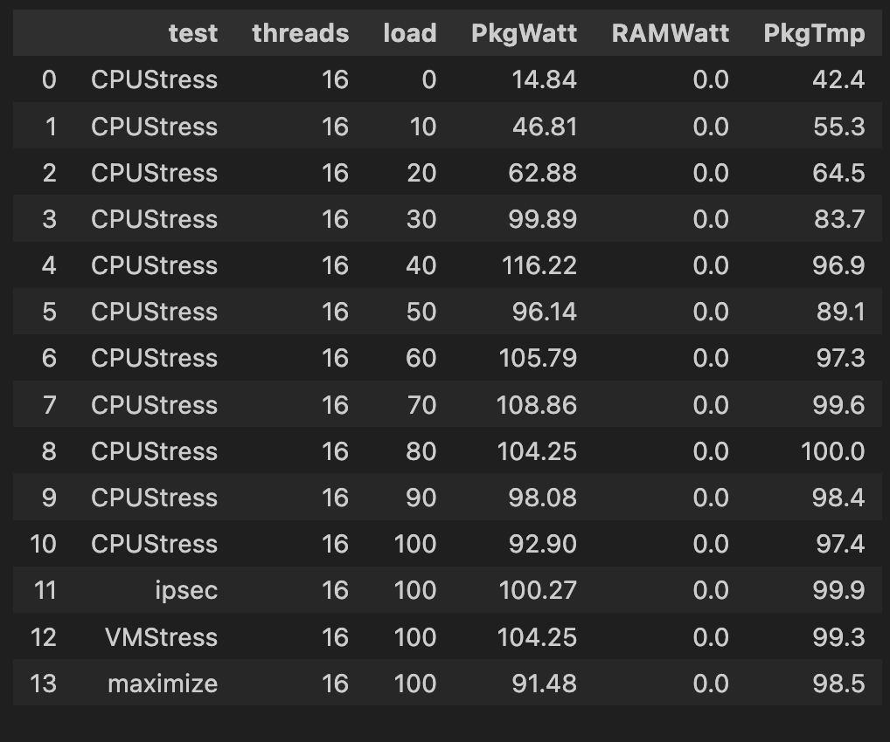
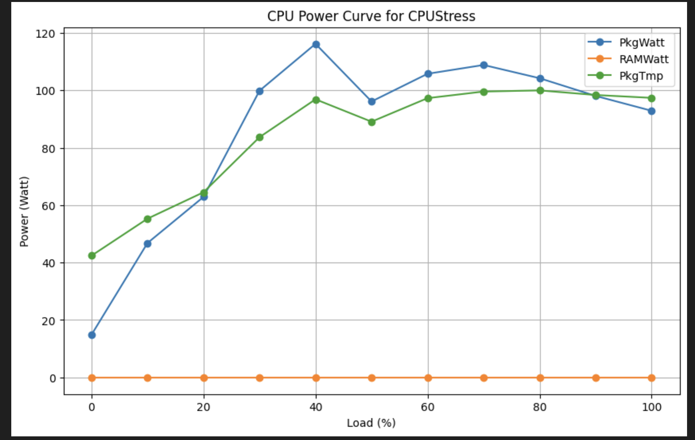
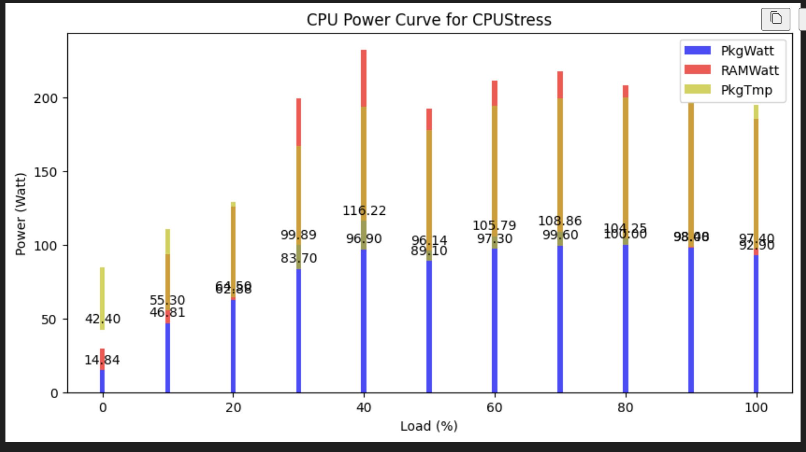

#### cmd
```
go run cmd/main.go --load-step=10 > i7-baremetal-loadstep10-fullreport-mar25.csv
```


### CPU Info
<p align="left"></p>


### Top command
<p align="center"></p>

### Dataframe
<p align="center"></p>

### CPU Load Tests
<p align="center"></p>

<p align="center"></p>


### Reference
https://medium.com/teads-engineering/estimating-aws-ec2-instances-power-consumption-c9745e347959